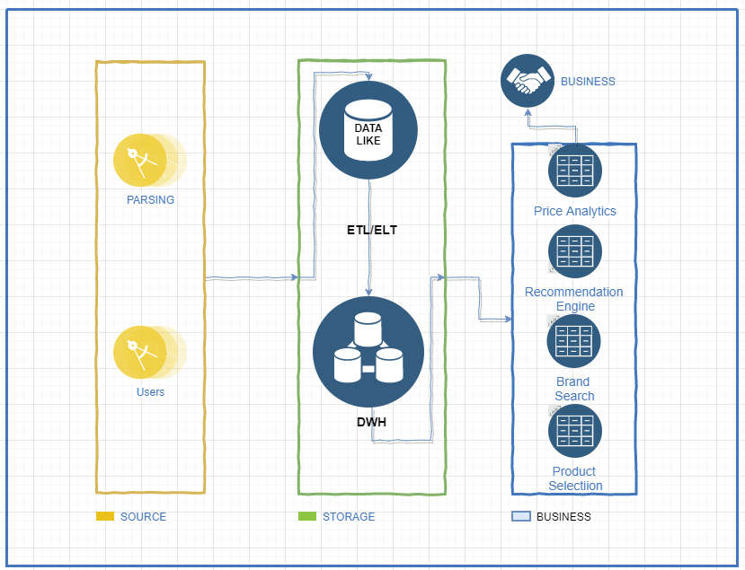

# DE-101 | Module 1

## What I did

### Git Setup
I installed Git and created my personal GitHub repository with the folder structure for all modules (`DE-101/Module1/`, `DE-101/Module2/`, etc.).

### Analytical Solution Architecture
I designed a high-level architecture diagram in **draw.io** showing three layers — Source, Storage, and Business — to illustrate how data flows from raw sources to business users.

### Excel Analytics
I analyzed the Sample Superstore dataset in Excel. I used VLOOKUP to cross-reference data, built pivot tables to summarize sales and profit, created charts to visualize trends, and put together a dashboard covering key metrics like Total Sales, Total Profit, Profit Ratio, and breakdowns by segment, category, region, and customer.

## Files
- `ARCHITECTURE.drawio` — analytics solution architecture diagram
- `Sample_Superstore.xlsx` — Excel analysis and dashboard
